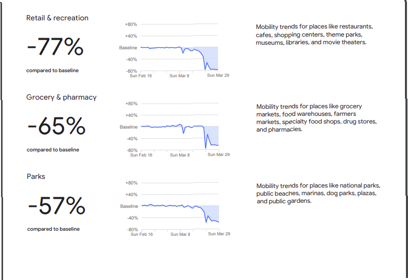
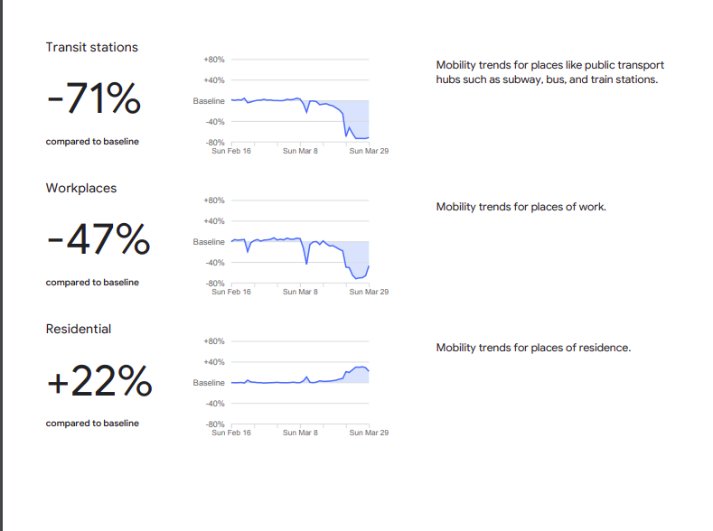
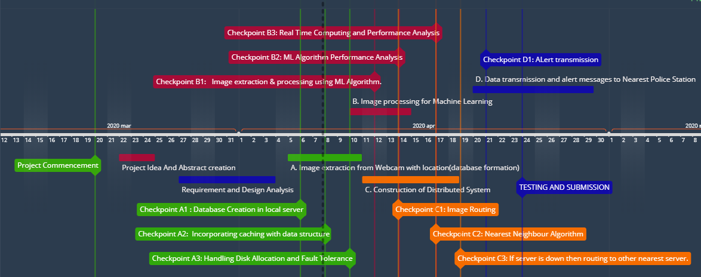
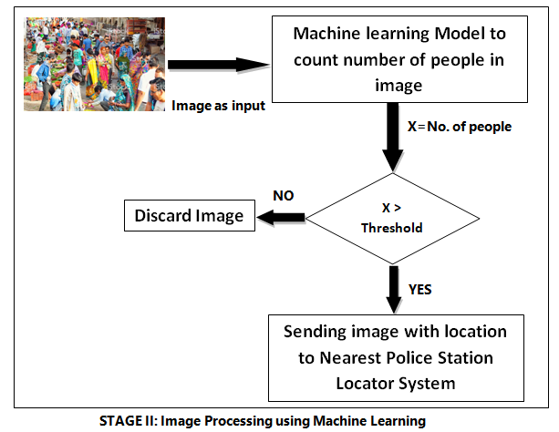
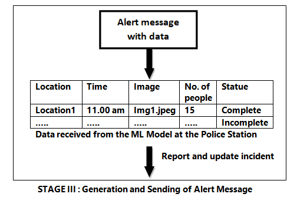

## Overview :

We are in a situation of Corona - Virus(COVID -19) pandemic. The government has declared a lockdown pan India in order to prevent people
from gathering at a place, which prevents the virus to spread amongst them, thus enforcing Social Distancing. Still it is observed on a 
daily basis that, for some reasons, people are violating this lockdown and gathering at places outside their homes. This may have severe 
effects and will definitely increase the spread of the virus.

India being a large country, it is sometimes difficult for local police stations to monitor and efficiently manage each and every area
under their jurisdiction, simultaneously.We have limited police force and with such population it is often difficult for the police to 
control the situation.Thus, we need a system, which will help them in managing this lockdown.This is the motivation behind developing 
our software.

The motivation of our software is to inform the police about such social gatherings so that they can take strict actions and help to 
avoid the transmission of COVID-19. The advantage of this system is that it helps the local police stations  to have an overall view 
of the town by just getting alert images, this way they don't have to waste their time in patrolling all the time around the city.

The overall idea is to develop a distributed system in which initially we take images from each camera located on various streets,
then using Machine learning algorithms identify the number of people in the image and if the number is greater than a particular set 
threshold, it sends an alert with time and location to the nearest police station.This is the main objective behind our software.
Thus, reducing the overall effort of local police stations and providing current updates about the situations in the city. 

## Context

As the current scenario has bought us face to face with a pandemic disease, major steps needs to be taken to fight and recover from it. To avoid being infected by Covid-19, the best way is to break the chain i.e, avoiding social gathering. Our Government though has declared curfew in all parts of India, there are some who are not following it.

The context of our software is to inform police about such social gatherings so that they can take strict actions and help to avoid the transmission of Covid-19. The advantage of this system is that it helps the police to have an overall view of the town by just getting alert images, this way they don't have to waste their time in patrolling all the time around the city.

Google prepared the following report graph to help us and public health officials understand responses to social distancing guidance related to COVID-19.

  

  

As on 5th Apr,The Indian authorities continue to maintain that the country still has not reached stage 3 or community transmission phase of the novel coronavirus, despite a steady climb in the numbers of positive cases.

We all are very well aware of the fact that "Next few days will be very important for all and we need to sustain our containment efforts and utilize all available resources as per the requirement,"

So,it is very important that lockdown should be implemented properly so that India successfully escapes the community transmission stage or the effects are minimised. And our model will surely help in mitigating the gathering of anti-social
elements and in turn reducing the destruction caused by corona virus or Covid-19.

The goal of this model is to capture images of various localities with the help of web cameras installed in different locations within the city and then processing those images to find out whether 
number of people in that image is greater than the set threshold. If they are, then that image along with the location of that locality is send to the nearest police station so that police can take immediate action against these people, which in turn will diminish the gathering of these anti-social elements.

## Goals:

a) The main objective of the software is to prevent social gathering of people above a certain threshold value by capturing images of different street locations with the help of webcams deployed in those areas.

b) The webcams will be distributed across the city and will be connected to a server monitoring the images captured by the webcams.

c) The servers will hold a database which will store an id corresponding to each webcam,location of the webcam ,image obtained from the webcam(in the form of pixels) and time at the image was captured.

d) The image obtained from the webcams will be proposed with the help of machine learning algorithms and the number of people at any time at any location will be obtained.

e) The server will also store data involving servers corresponding to nearest police stations.

f) If the image obtained from any particular webcam involves huge crowding of people then the server will locate the nearest police station .

h) An alert message will be generated and the time and location of the corresponding webcam will be sent to the server of the nearest police station so that necessary actions can be taken on time.

i) There will be multiple such interconnected servers for each every 10 to 15 webcams.

SCOPE AND TIMELINE:

  

## Milestones:
### The following need to be checked point as our progress continues..    

 a) Image extraction from Webcam with location(database formation)
 
        Checkpoint 1: successfully storing image with its location in local server Database 
        
        Checkpoint 2: maintaining a  queue data structure for caching,
        
        Checkpoint 3: and if queue overflows then it is stored in disk, and retrieved back after some time.
        
 b) Image processing for Machine Learning
 
        Checkpoint 4: image extraction and Detecting crowd in the image using ML Algorithm
        
        Checkpoint 5: getting image from CCTV after every 5 min, storing it in database
                      and applying ML, should happen in parallel.
                       
c) Formation of Distributed System

       Checkpoint 6: successfully routing image to other server
       
       Checkpoint 7: Algorithm to find nearest neighbour, and applying consistent hashing methodology
       
       Checkpoint 8: If server is down then routing to other nearest server
    
d) Data transmission and alert messages to Nearest Police Station

       Checkpoint 9: raise a alert message if number of people crossed the set threshold
       
## Proposed Solution :
  
Covid-19 is in high demand right now,so our model will be over it in such a way that cameras are installed at different places and these cameras will store the data of that place and put the stored data 
on the server. The image obtained from the webcamera server will be processed using Machine learning tools and the number of people at any point at any location will be obtained. The  data of the server
of these different places will be sent to the server of a nearest police station,so that police will find out how many people are standing in the crowd. If the number of people is more than the given threshold
the police will act on them.
    
Our model will have the most important role of the distributed system.

 In a distributed system, the following things happen:
     
 -> All servers ,software and hardware components are located remotely.they coordinate and communicate with each other by passing the messages.
 
 ->Resource sharing is the most important aspect of a distributed system. resources are managed by the servers and clients uses these resources.
     
  ### The second part of this project is how to extract the images from webcam and store the image in database with webcam location:
  
  This task needs to be done in 3 parts:
  
  (i) Extracting image from webcam:
            → Webcam will capture the video continously,so we need to extract image frames from that video stream after some
              particular interval.This can be done using openCV and timer from time package in python.Also, we need to take               care 
              of deleting/overwriting images after a particular time interval in database.
              
  

  
  

              
 (ii) Fetching the location of webcam
            → We will fetch the location of webcam, using already created database (which we have created while installing                 the cameras).
              The proposed structure of this database is <license_number,location>. Using this license number we will fetch               the location of the webcam.
              
  

  
  

              
  (iii) Storing image with corresponding webcam location in the database
            → After fetching the location of webcam,the information containing webcam info.(i.e, license number in our                     case),image, location of the webcam will be stored in one of the distributed server, which can be further used               for processing the image.
            
  

  
  

              
    
 ### Name of some machine learning techniques that will be used in this project-
 
The technique to estimate the number of objects/entities in an image is called “Crowd Counting”. In our case we will perform people counting ie., to find the count of people present in an image. There are various ways to perform this, which

 ->Regression based methods
 
 ->Detection based methods
 
 ->Density Estimation based methods
 
 ->CNN(Convolutional Neural Network) based methods
 
 ### The Third part of this project is :Data transmission and Alert message
 
   (i)Data transmission:
      The incoming picture will hit the image sensor of the Webcame which will break it up into individual pixels.The             individual pixels will be converted into numeric form and stored in the database.
      
   (ii)Alert message:
     If data from a particular Webcam involves gathering of people then the location of the corresponding Webcam will            be extracted from the database and a message will be generated.    

## Discussion :

* The idea is to develop a system using Machine Learning + Distributed system architecture to detect crowd in different areas in a city and to inform the local police stations about this issue, in order to prevent COVID-19.

* A distributed system contains multiple nodes that are physically separate but linked together using the network and coordinate actions in order to appear as a single coherent system to the end user.

* The role of the Distributed System is that cameras are installed at different places and these cameras will store the data of that place and put the stored data on the server. 

* The image obtained from the web camera server will be processed using Machine learning tools and the number of people at any point at any location will be obtained. The data of the server of these different places will be sent to the server of a nearest police station, so that police will find out how many people are standing in the crowd. 

* Webcam will capture the video continuously, so we need to extract image frames from that video stream after some particular interval. This can be done using openCV and timer from the time package in python. Also, we need to take care of deleting/overwriting images after a particular time interval in the database.

* We will fetch the location of the webcam, using an already created database (which we have created while installing the cameras).The proposed structure of this database is . Using this license number we will fetch the location of the webcam.

* The information containing the webcam information, image, location of the webcam will be stored in one of the distributed servers, which can be further used for processing the image.

* After this using  Machine Learning algorithms, Crowd Counting will be performed, ie, the number of people in a particular image. If it crosses the threshold, then it will be sent to the nearest local police station for further action.

* If data from a particular Webcam involves gathering of people then the location of the corresponding Webcam will be extracted from the database and a message will be generated.

* The images will be collected after every 5-10 minutes of gap, and will be checked simultaneously and information will be sent to the stations, immediately if violation is found out at a particular place. Thus police will take directed action instantly, without miss and delays.
