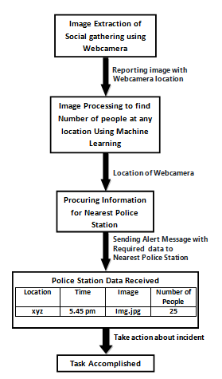
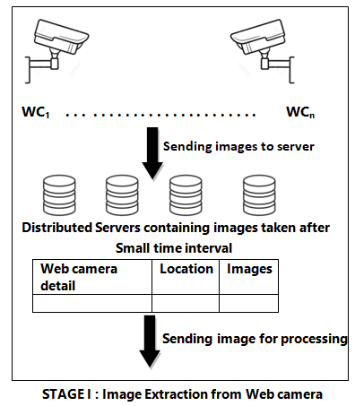

# Software-Engineering-project
Police informant system to detect social gathering during covid-19 breakdown

    I. Motivation
    II. Introduction
    III. Proposed Model
    a) Formation of Distributed System
    b) Image extraction from Webcam with location(database formation)
    c) ML on images
    d) Data transmission and alert messages

# I. MOTIVATION

As the current scenario has brought us face to face with a pendamic disease, major steps needs to be taken to fight and recover from it. To avoid being infected by Covid-19, the best way is to break the chain i.e. avoiding social gathering. Our Government though has declared curfew in all parts of india, the citizens are not follwing it. 

The motivation of our software is to inform the police about such social gatherings so that they can take strict actions and help to avoid the transmission of Covid-19. The advantage of this system is that it helps the Police to have an overall view of the town by just getting alert images, this way they dont have to waste their time in patrolling all the time around the city.
    
# II. INTRODUCTION

Our propsed software is "Police informant system to detect social gathering during covid-19 breakdown". The idea is to develop a distributed system in which initially we take images from each camera located on various streets. Then using Machine learning algorithm identify the number of people in that image and if the number is greater than the set threshold, it sends an alert with time and location to the nearest police station.

Shown in the image below is an abstract view of the control flow of the model. 

  

  

# III. PROPOSED MODEL

 ## A) Formation of Distributed System .
    
Distributed System is a system with multiple components located on different machines that communicate and coordinate actions in order to appear as a single coherent system to the end user.\
In our project,the role of Distributed System is that cameras are installed at different places and these cameras will         store the data of that place and put the stored data on the server.and the data of the server of these different places       will be sent to the server of a nearest police station,so that police will find out how many people are standing in the       crowd. If 5 or more people stand in the crowd then the police will act on them.
    
## B) Image Extraction from Webcam and storing the image in database with webcam location.

  This task needs to be done in 3 parts:\
   (i) Extracting image from webcam:\
      → Webcam will capture the video continously,so we need to extract image frames from that video stream after some       
        particular interval.This can be done using openCV and timer from time package in python.Also, we need to take care of 
        deleting/overwriting images after a particular time interval in database.\
   (ii) Fetching the location of webcam\
      → We will fetch the location of webcam, using already created database (which we have created while installing the             cameras).The proposed structure of this database is <license_number,location>. Using this license number we will
        fetch the location of the webcam.\
   (iii) Storing image with corresponding webcam location in the database\
       → After fetching the location of webcam,the information containing webcam info.(i.e, license number in our case),
         image(in matrix form), location of the webcam will be stored in one of the distributed server.That is one tuple of
         database will look like (license_number,image,location),which can be further used for processing the image.
